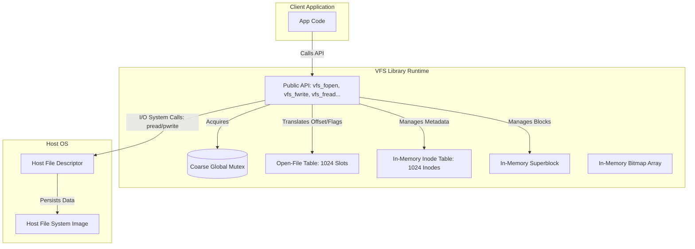
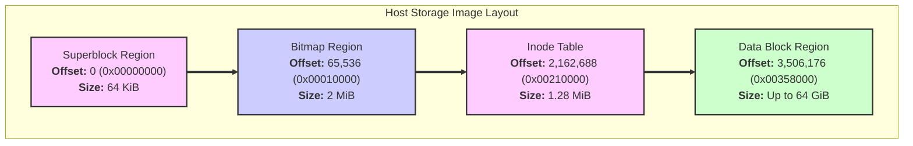
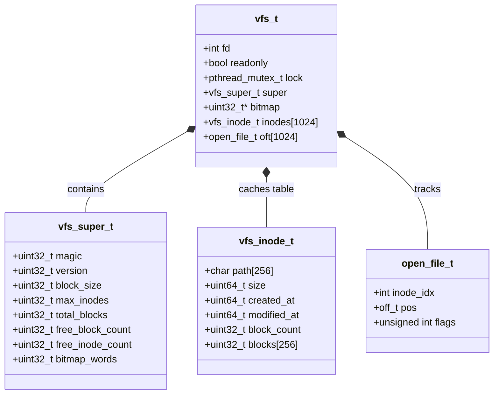
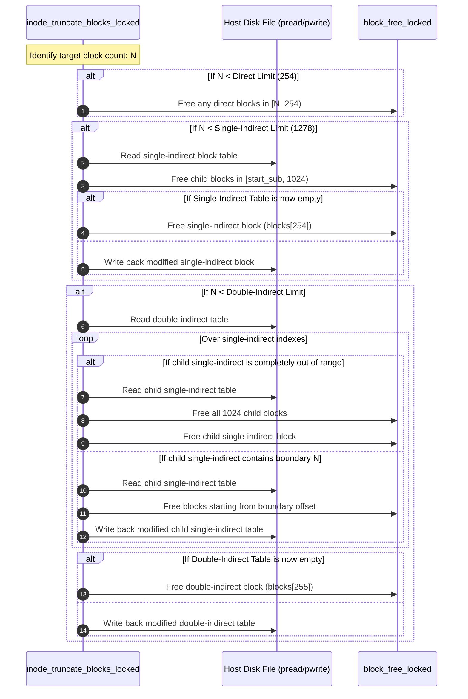

# Single-File Virtual Filesystem (VFS) Architectural Specification

This document provides a detailed overview of the architecture, on-disk layout, memory management, and execution flows of the single-file Virtual Filesystem (VFS) implementation.

---

## 1. High-Level Architecture

The VFS is a flat-namespace virtual filesystem contained entirely within a single host image file. It exposes a file-descriptor-based interface (similar to POSIX) to interact with logical files. 



---

Here is the revised Section 2 of the **Single-File Virtual Filesystem (VFS) Architectural Specification**. 

The Gantt chart representation has been replaced with a structural block flow diagram and an ASCII layout grid. This visualizes the regions sequentially without squeezing the smaller metadata areas into microscopic, unreadable columns due to the scale difference between $64\text{ KiB}$ and $64\text{ GiB}$.

---

## 2. On-Disk Layout

The host storage image is divided into four contiguous, non-overlapping physical regions:
1.  **Superblock Region**: Fixed at `65,536` bytes. Contains filesystem metrics.
2.  **Block Allocation Bitmap**: Fixed at `2,097,152` bytes ($2\text{ MiB}$). Contains the block allocation bitmap.
3.  **Inode Table**: Holds `1,024` static, fixed-size directory entries (`vfs_inode_t`), each occupying `1,312` bytes.
4.  **Data Region**: Subdivided into physical data blocks of `4,096` bytes each.

### 2.1 Sequential Region Mapping



```
+---------------------------------------------------------------------------------------------------------------------+
|                                        PHYSICAL ON-DISK LAYOUT (64 GiB IMAGE)                                       |
+--------------------------+------------------------------+----------------------------+------------------------------+
|    SUPERBLOCK REGION     |        BITMAP REGION         |        INODE TABLE         |      DATA BLOCK REGION       |
|         (64 KiB)         |           (2 MiB)            |        (1.28 MiB)          |        (Up to 64 GiB)        |
+--------------------------+------------------------------+----------------------------+------------------------------+
0                     65,536                      2,162,688                    3,506,176                 68,722,982,912
0x00000000            0x00010000                  0x00210000                   0x00358000                  0x1000358000
```

### 2.2 Sizing and Address Calculations

The table below defines the exact physical parameters, structures, offsets, and boundaries for aligned disk access:

| Region Name           | Starts at Byte Offset (Decimal) | Starts at Byte Offset (Hexadecimal) | Region Capacity                                | Contained Structural Type                    |
| :-------------------- | :------------------------------ | :---------------------------------- | :--------------------------------------------- | :------------------------------------------- |
| **Superblock**        | `0`                             | `0x00000000`                        | $64\text{ KiB}$ (`65,536` bytes)               | `vfs_super_t` (padded to boundary)           |
| **Allocation Bitmap** | `65,536`                        | `0x00010000`                        | $2\text{ MiB}$ (`2,097,152` bytes)             | `uint32_t bitmap[524,288]`                   |
| **Inode Table**       | `2,162,688`                     | `0x00210000`                        | $1.28\text{ MiB}$ (`1,343,488` bytes)          | `vfs_inode_t inodes[1024]`                   |
| **Data Region**       | `3,506,176`                     | `0x00358000`                        | Up to $64\text{ GiB}$ (`68,719,476,736` bytes) | Raw physical payload blocks of $4,096$ bytes |

*   **Inode Size Verification**:
    Each `vfs_inode_t` structure maintains a strict binary size of exactly `1,312` bytes to prevent data misalignment:
    $$\text{sizeof(vfs\_inode\_t)} = \underbrace{256}_{\text{path}} + \underbrace{8}_{\text{size}} + \underbrace{16}_{\text{timestamps}} + \underbrace{4}_{\text{block\_count}} + \underbrace{1024}_{\text{block pointer array}} + \underbrace{4}_{\text{padding}} = 1,312\text{ bytes}$$
*   **Total Addressable Data Blocks (`VFS_TOTAL_BLOCKS`)**: 
    With $16,777,216$ data blocks at $4,096$ bytes per block, the total addressable physical capacity is exactly $68,719,476,736$ bytes. This, when added to the metadata offset, limits the maximum possible storage file size to $68,722,982,912$ bytes (~64.003 GiB).
---

## 3. In-Memory Representation

The in-memory handle (`vfs_t`) coordinates system runtime structures, metadata caches, and hardware interaction channels.



### 3.1 Metadata Caching Strategy
*   **Superblock, Bitmap, and Inodes**: Loaded entirely into memory during `vfs_open()`. Written back collectively upon calling `vfs_sync()` or `vfs_close()`. Standard file creation/truncation updates individual cached entries in memory and flushes only the affected inode block to disk via `inode_write_locked()`.
*   **Data Blocks**: No memory cache is maintained for file payloads. Reads and writes bypass memory structures and execute directly against the host file using `pread()` and `pwrite()`.

---

## 4. Key Design Mechanics

### 4.1 Locking Strategy & Deadlock Prevention
The entire filesystem operates under coarse-grained locking using a `pthread_mutex_t` located inside `vfs_t`.
*   Public API functions (e.g., `vfs_fopen`, `vfs_fwrite`) acquire the lock immediately upon entry and release it prior to exit.
*   Internal functions (suffixed with `_locked`) rely on the caller to maintain the locked state.
*   **Re-entrancy Protection**: During path traversal in `vfs_list()`, the system releases `vfs->lock` before invoking the user-provided callback function. This prevents a deadlock if the callback attempts to invoke another synchronized VFS function (e.g., `vfs_stat` or `vfs_fread`) from the same thread.

### 4.2 Block Allocation Bitmap & Low Write Amplification
Block status is evaluated using a bit array where `1` represents a free block and `0` indicates an allocated block.
*   **Bit-level indexing**: For physical block ID $N$:
    $$\text{Word index} = \lfloor N / 32 \rfloor, \quad \text{Bit shift} = N \pmod{32}$$
*   On creation, all bitmap words are initialized to `0xFFFFFFFF` (all blocks free).
*   **Low Write Amplification**: To avoid writing the entire $2\text{ MiB}$ bitmap to disk on every allocation/free, the system writes only the modified 32-bit word using `bitmap_write_word_locked()`.

### 4.3 Multi-Level Indirect Pointers
The `blocks` array of size 256 in `vfs_inode_t` is partitioned into direct, single-indirect, and double-indirect blocks:
*   **Direct Blocks (0 to 253)**: Points directly to physical block IDs.
*   **Single-Indirect Block (254)**: Points to a block containing up to $1,024$ physical block pointers.
*   **Double-Indirect Block (255)**: Points to a block containing up to $1,024$ pointers to single-indirect blocks, each of which points to $1,024$ data blocks.

#### Structural Equations & Limits:
*   **Direct Capacity**: $254 \times 4,096\text{ bytes} = 1,040,384\text{ bytes}$ (~$1\text{ MiB}$).
*   **Single-Indirect Capacity**: $1,024 \times 4,096\text{ bytes} = 4,194,304\text{ bytes}$ ($4\text{ MiB}$).
*   **Double-Indirect Capacity**: $1,024 \times 1,024 \times 4,096\text{ bytes} = 4,294,967,296\text{ bytes}$ ($4\text{ GiB}$).
*   **Maximum Logical File Size**:
    $$\text{Max Blocks} = 254 + 1024 + 1,048,576 = 1,049,854\text{ blocks}$$
    $$\text{Max File Size} = 1,049,854 \times 4096 = 4,299,177,984\text{ bytes} \approx 4.003\text{ GiB}$$

---

## 5. Execution Flows

### 5.1 Block Mapping Flow (`vfs_bmap_locked`)

The resolution of a logical block index $L$ to its physical block ID $P$ follows this mapping logic:

```mermaid
flowchart TD
    A[Start Block Map] --> B{L < 254?}
    B -- Yes [Direct] --> C[Return physical block from in->blocks[L]]
    B -- No --> D{L < 1278?}
    D -- Yes [Single Indirect] --> E[Calculate sub_index = L - 254]
    E --> F[Read table block in->blocks[254]]
    F --> G[Return physical block from table[sub_index]]
    D -- No [Double Indirect] --> H[Calculate offset = L - 1278]
    H --> I[Calculate dib_index = offset / 1024]
    I --> J[Calculate sib_index = offset % 1024]
    J --> K[Read double-indirect table in->blocks[255]]
    K --> L[Read single-indirect table from dib_table[dib_index]]
    L --> M[Return physical block from sib_table[sib_index]]
```

### 5.2 Truncate & Deallocation Flow

The system processes deallocation hierarchically. When shrinking or unlinking a file to logical block size $N$, the blocks are cleared in reverse cascading order:


