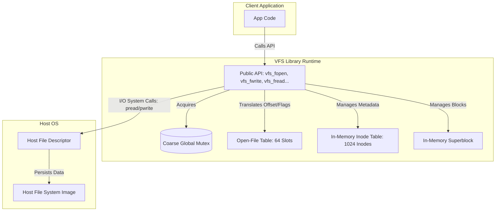
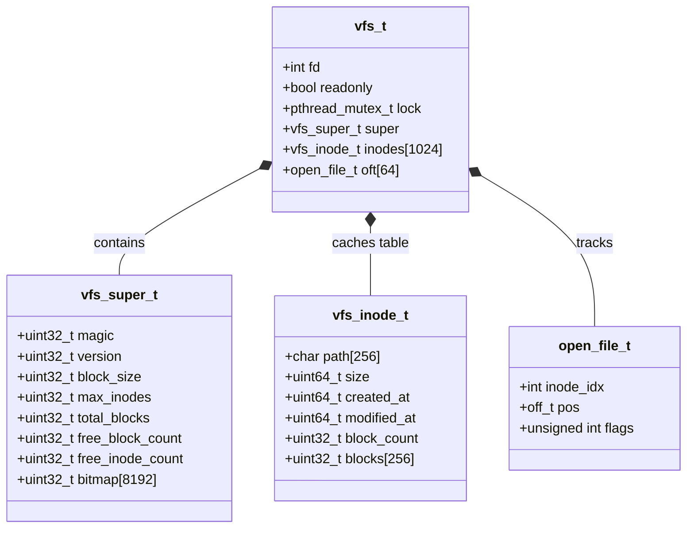
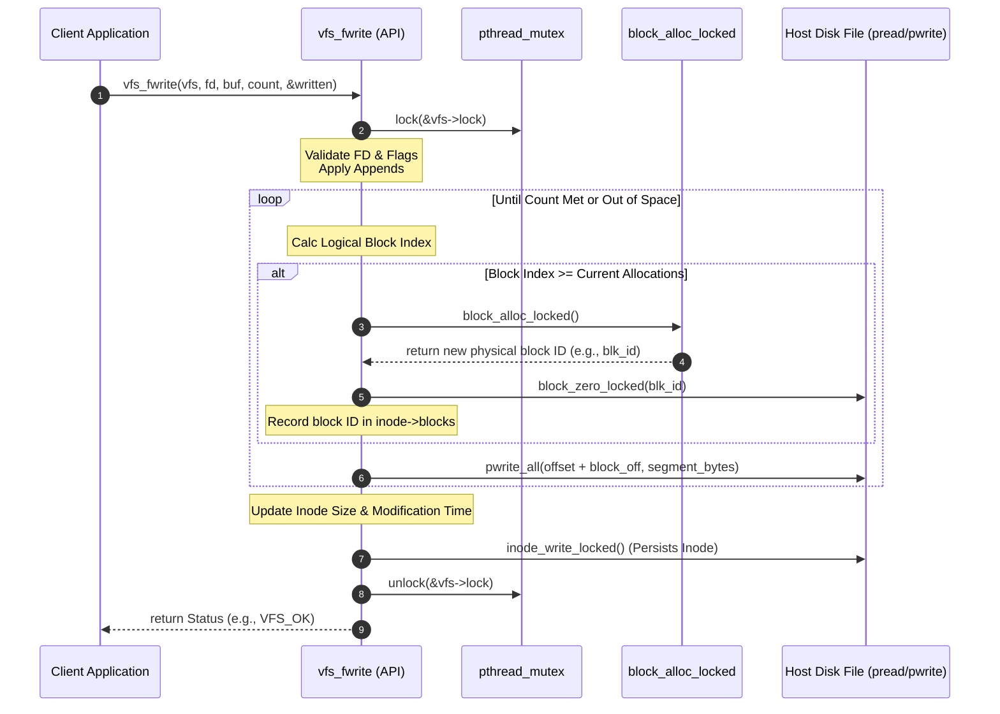
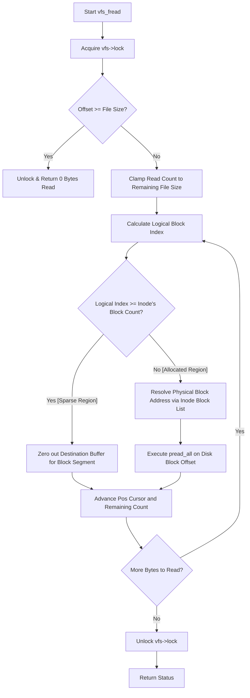

# Single-File Virtual Filesystem (VFS)

This document provides a detailed overview of the architecture, on-disk layout, memory management, and execution flows of the single-file Virtual Filesystem (VFS) implementation.

---

## 1. High-Level Architecture

The VFS is a flat-namespace virtual filesystem contained entirely within a single host image file. It exposes a file-descriptor-based interface (similar to POSIX) to interact with logical files. 

---

## 2. On-Disk Layout

The host storage image is divided into three contiguous, non-overlapping physical regions:
1.  **Superblock Region**: Fixed at `65,536` bytes. Contains filesystem metrics and the block allocation bitmap.
2.  **Inode Table**: Holds `1,024` static, fixed-size directory entries (`vfs_inode_t`), each occupying `1,312` bytes.
3.  **Data Region**: Subdivided into `262,144` physical data blocks of `4,096` bytes each.

```mermaid
gantt
    title Virtual Disk Geometry (Offset Mapping)
    dateFormat  X
    axisFormat %s
    section Regions
    Superblock Region (64 KiB) :active, 0, 65536
    Inode Table (1.28 MiB)    :crit, 65536, 1409024
    Data Blocks (1.00 GiB)    :normal, 1409024, 1075150848
```

### 2.1 Offset and Sizing Calculations

*   **Superblock (`VFS_SUPERBLOCK_SIZE`)**: `65,536` bytes ($64\text{ KiB}$).
*   **Inode Table Offset (`VFS_INODE_TABLE_OFFSET`)**: `65,536` bytes.
*   **Inode Size**: Each `vfs_inode_t` is exactly `1,312` bytes:
    $$\text{sizeof(vfs\_inode\_t)} = \underbrace{256}_{\text{path}} + \underbrace{8}_{\text{size}} + \underbrace{16}_{\text{timestamps}} + \underbrace{4}_{\text{block\_count}} + \underbrace{1024}_{\text{block pointer array}} + \underbrace{4}_{\text{padding}} = 1,312\text{ bytes}$$
*   **Total Inodes**: $1,024$ entries $\implies$ Inode table occupies $1,024 \times 1,312 = 1,343,488\text{ bytes}$ ($1.28\text{ MiB}$).
*   **Data Region Offset (`VFS_DATA_OFFSET`)**: Starts at physical offset `1,409,024` ($65,536 + 1,343,488$).
*   **Total Addressable Data Blocks (`VFS_TOTAL_BLOCKS`)**: $1,024 \times 256 = 262,144$ blocks. At $4,096$ bytes per block, the maximum data payload capacity is $1,073,741,824$ bytes ($1\text{ GiB}$).

---

## 3. In-Memory Representation

The in-memory handle (`vfs_t`) coordinates system runtime structures, metadata caches, and hardware interaction channels.

### 3.1 Metadata Caching Strategy
*   **Superblock and Inodes**: Loaded entirely into memory during `vfs_open()`. Written back collectively upon calling `vfs_sync()` or `vfs_close()`. Standard file creation/truncation updates the individual cached entries in memory and flushes only the affected inode block to disk via `inode_write_locked()`.
*   **Data Blocks**: No memory cache is maintained for file payloads. Reads and writes bypass memory structures and execute directly against the host file using `pread()` and `pwrite()`.

---

## 4. Key Design Mechanics

### 4.1 Locking Strategy & Deadlock Prevention
The entire filesystem operates under coarse-grained locking using a `pthread_mutex_t` located inside `vfs_t`.
*   Public API functions (e.g., `vfs_fopen`, `vfs_fwrite`) acquire the lock immediately upon entry and release it prior to exit.
*   Internal functions (suffixed with `_locked`) rely on the caller to maintain the locked state.
*   **Re-entrancy Protection**: During path traversal in `vfs_list()`, the system releases `vfs->lock` before invoking the user-provided callback function. This prevents a deadlock if the callback attempts to invoke another synchronized VFS function (e.g., `vfs_stat` or `vfs_fread`) from the same thread.

### 4.2 Block Allocation Bitmap
Block status is evaluated using a bit array where `1` represents a free block and `0` indicates an allocated block.
*   **Bit-level indexing**: For physical block ID $N$:
    $$\text{Word index} = \lfloor N / 32 \rfloor, \quad \text{Bit shift} = N \pmod{32}$$
*   On creation, all bitmap words are initialized to `0xFFFFFFFF` (all blocks free).

---

## 5. Execution Flows

### 5.1 File Write Flow (`vfs_fwrite`)

This sequence diagram illustrates the boundary interactions and disk updates performed during a logical write operation.

### 5.2 File Reading and Sparse-Block Handling (`vfs_fread`)

When a read operation targets an address outside the physical bounds of an allocated block range (but within the file size limit, such as inside a sparse file), the implementation routes virtual zeroes back to the application buffer rather than reading uninitialized or random data from disk.

